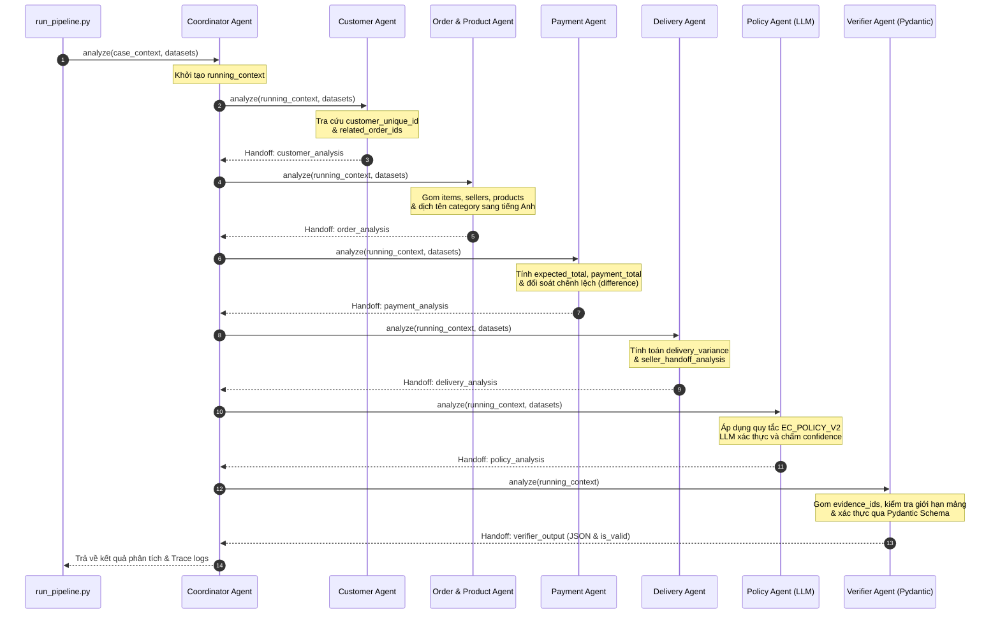

# MULTI-AGENT SYSTEM ARCHITECTURE DOCUMENTATION

Tài liệu mô tả kiến trúc, vai trò, quyền truy cập dữ liệu và luồng chuyển giao thông tin (handoff) của hệ thống Multi-Agent giải quyết khiếu nại (dispute resolution) trên nền tảng thương mại điện tử Olist.

---

## 1. Sơ đồ luồng hoạt động (Orchestration & Handoff Flow)

Hệ thống được thiết kế theo mô hình **Orchestrator-Workers (Coordinator-Agents)**. 
Trong đó, **Coordinator Agent** đóng vai trò bộ điều phối trung tâm, quản lý vòng đời chạy của case, tuần tự gọi các Agent chuyên trách và tích lũy thông tin vào ngữ cảnh chung (`running_context`) trước khi chuyển giao sang Agent tiếp theo.

---

## 2. Vai trò chi tiết & Quyền truy cập dữ liệu (Data Access Control)

Hệ thống áp dụng nguyên tắc tối giản quyền lực (Least Privilege). Mỗi Agent con chỉ được cấp quyền đọc các bảng dữ liệu liên quan trực tiếp đến nghiệp vụ của mình nhằm tối ưu hiệu năng bộ nhớ và tăng tính đóng gói.

| Tên Agent | Nhiệm vụ nghiệp vụ | Bảng dữ liệu được phép đọc (Read-only) |
| :--- | :--- | :--- |
| **Coordinator Agent** | • Nhận đầu vào, thiết lập luồng xử lý tuần tự. • Phối hợp và chia sẻ ngữ cảnh giữa các agent. • Thu thập log trace vết chạy hệ thống. | *Không trực tiếp đọc dữ liệu thô.* |
| **Customer Agent** | • Xác định mã định danh duy nhất khách hàng (`customer_unique_id`). • Tìm kiếm lịch sử giao dịch cũ của khách hàng trong hệ thống. | `orders`, `customers` |
| **Order & Product Agent** | • Trích xuất danh sách sản phẩm, các mã giao dịch mặt hàng, người bán liên quan. • Dịch thuật danh mục sản phẩm từ tiếng Bồ Đào Nha sang tiếng Anh. | `order_items`, `products`, `product_category_name_translation` |
| **Payment Agent** | • Tính toán tổng tiền thực tế khách đã trả và tổng tiền lý thuyết đơn hàng. • Đối soát chênh lệch tiền tệ và xác nhận trạng thái hòa khớp thanh toán. | `order_items`, `order_payments` |
| **Delivery Agent** | • Tính toán mức độ chênh lệch thời gian giao nhận thực tế so với dự kiến. • Phân tích thời hạn bàn giao của từng Seller để phát hiện trễ hạn. | `orders`, `order_items` |
| **Policy Agent** | • Áp dụng chính sách `EC_POLICY_V2` để phân loại lỗi chính/phụ. • Gọi mô hình LLM để đánh giá sự logic và cho điểm tin cậy (`confidence`). | *Đọc ngữ cảnh tổng hợp từ các agent trước đó trong running_context.* |
| **Verifier Agent** | • Thu thập các bằng chứng liên quan trực tiếp thành định dạng `evidence_ids`. • Cắt giảm độ dài các mảng đầu ra theo giới hạn quy định. • Xác thực đầu ra bằng mô hình Pydantic Schema. | *Đọc kết quả tổng hợp cuối cùng từ context.* |

---

## 3. Luồng dữ liệu chuyển giao (Handoff Details)

Dữ liệu được chuyển giao qua các bước dưới dạng một cấu trúc Từ điển Python (`running_context`) tích lũy dần:

1. **Từ Customer Agent:** Thêm thông tin khách hàng vào `customer_analysis`.
2. **Từ Order & Product Agent:** Thêm thông tin chi tiết đơn hàng vào `order_analysis`.
3. **Từ Payment Agent:** Thêm kết quả đối soát tài chính vào `payment_analysis`.
4. **Từ Delivery Agent:** Thêm các mốc thời gian và độ lệch giờ vào `delivery_analysis`.
5. **Từ Policy Agent:** Thực hiện phân loại nghiệp vụ, chấm điểm tự động thông qua API của Qwen hoặc Gemini, lưu vào `policy_analysis`.
6. **Từ Verifier Agent:** Trích lọc các ID thực thể làm bằng chứng, xác minh cấu trúc dữ liệu theo đúng chuẩn Pydantic `CaseOutput` và tạo file kết quả.
